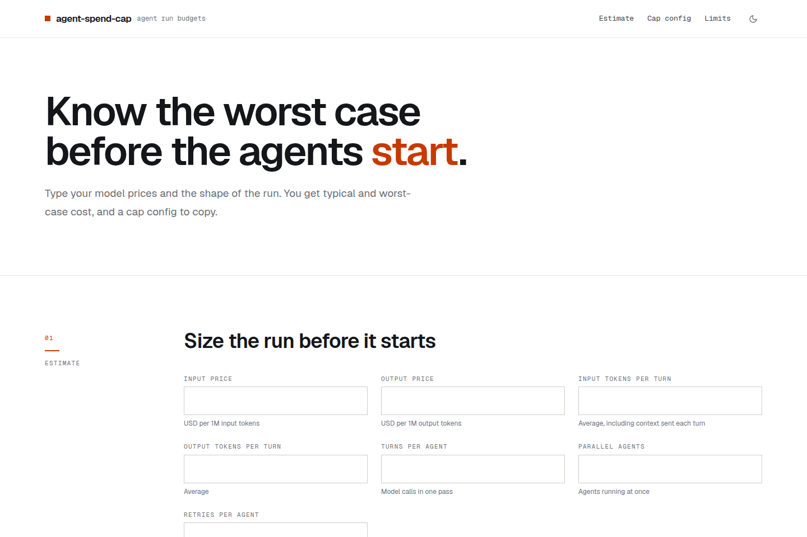
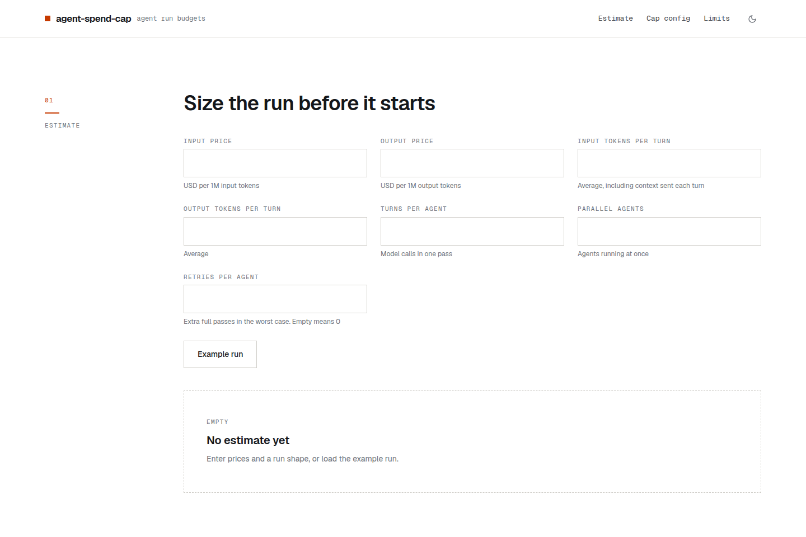
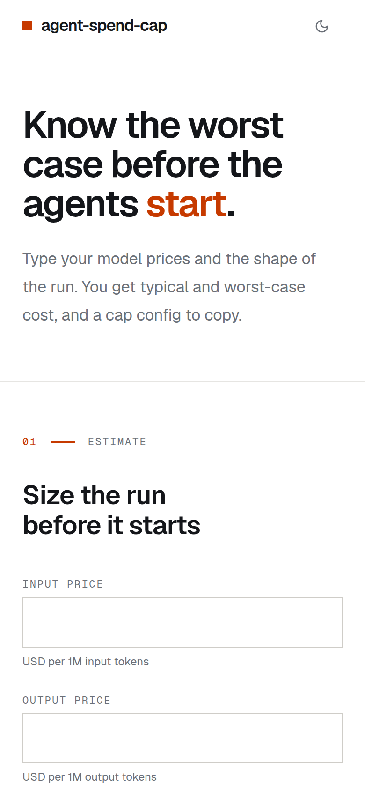

<!--
  The Factory fills in this README from blueprint.md (see CLAUDE.md → "README"). Replace every line in brackets;
  keep the section order. The greenlight:live and greenlight:screenshots blocks are written by the Publisher after
  each deploy (live link, screenshots of the live site): keep their markers and leave their contents alone.
-->

# agent-spend-cap

Estimate the worst-case cost of an unattended coding-agent run and copy a spend-cap config for your own tool.

<!-- greenlight:live -->
**[Open agent-spend-cap → agent-spend-cap.yangxdev.workers.dev](https://agent-spend-cap.yangxdev.workers.dev)**
<!-- /greenlight:live -->

<!-- greenlight:screenshots -->
<picture>
  <source media="(prefers-color-scheme: dark)" srcset="docs/screenshots/desktop-dark.png">
  
</picture>

<picture>
  <source media="(prefers-color-scheme: dark)" srcset="docs/screenshots/section-dark.png">
  
</picture>

<p align="center">
<picture>
  <source media="(prefers-color-scheme: dark)" srcset="docs/screenshots/mobile-dark.png">
  
</picture>
</p>

<sub>Screenshots of the live site, refreshed on every deploy. They follow your GitHub theme.</sub>
<!-- /greenlight:screenshots -->

## What it does

- Estimates the typical cost of an agent run from prices and a run shape you type.
- Shows the worst case, where every agent retries, and a "Reported fan-out" row that applies the same settings to 826 agents.
- Writes a max-turns value, a max-subagents value and a spend-stop hook for Claude Code, Codex or a generic setup.
- Keeps every input in the URL, so an estimate is a link you can share.

## How to use it

1. Type the input and output price per million tokens and the run shape, or press "Example run".
2. Read Typical, Worst case and Reported fan-out under "01 Estimate".
3. Under "02 Cap config", pick a tool and optionally set a spend cap.
4. Press "Copy config" or "Copy link".

The config templates are unchecked examples. Check their names and flags against your tool's docs before relying on them.

## Privacy

Nothing leaves your browser: there is no account, no server storage and no price feed. The query string holds your inputs, and the only thing kept in `localStorage` is your theme choice. Page views are counted by Cloudflare Web Analytics, which sets no cookies.

## Contributing

Open an issue for a wrong number, an out-of-date config template or an idea. For a template fix, edit `src/features/cap-config/templates.ts`: a good entry names real settings and flags, and sets `verifiedOn` to the date you checked them against the tool's docs.

## Run it locally

Needs Node.js 22.18 or later.

```bash
npm ci
npm run dev     # the app at http://localhost:5173 (the /api Worker is not running)
npm run check   # lint, tests and a production build
```

`npm run build && npx wrangler dev` serves the built app together with the `/api` Worker.

## Built with

React 19, Vite, Redux Toolkit and Tailwind CSS v4, served by a Cloudflare Worker.

---

Made by [yangxdev](https://github.com/yangxdev). [MIT licensed](LICENSE.md).
